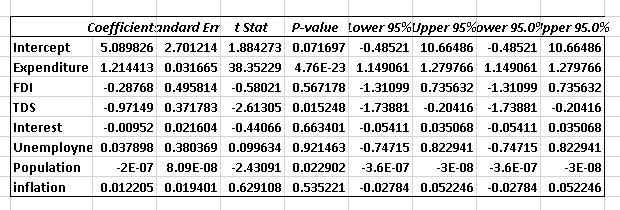

# ECONOMIC INDICATORS ANALYSIS IN KENYA 
    Kenya(1991-2022)

# Table of Contents
  [Introduction](#Introduction)

# Introduction
This study aims to explore the key economic indicators influencing Kenya’s GDP. The analysis covers variables such as Government Expenditure, Foreign Direct Investments (FDI), Interest Rates, Inflation, Total Debt Service, Population, and Unemployment within the period 1991 to 2022. By examining these factors, we seek to understand their impact on GDP and provide actionable recommendations for enhancing economic stability and growth. A;; data was sourced from The World Bank.

# Visuals

# Observations 
GDP has been increasing over the years with 2000 being the last time it declined (-1. 5%).It is important to note that GDP has been increasing at a decreasing rate over the last 5 Years.
Government Expenditure has also been steadily increasing since 1991.The government is always spending more as time moves on.
Foreign Direct Investments have been extremely volatile over the years. This is highlighted by Kenya’s inability to maintain consecutive FDI Increase for more than 2 years since 2010.Moreoveer Kenya received the highest FDI inflows between 2010 and 2019 and is yet to recover to those heights.
Interest rates have also been observed to be highly volatile and have been trending downwards from their highest point during the period between 1994 and 2002(15-21%).On the other hand Interest rates have ranged between 5.7 and 10.1% in the last decade.
Inflation has been observed to be highly volatile with significant increase and decrease annually. However, over the last 5 years it has been increasing at an increasing rate to 7.4% in 2022.
Total Debt service has been gradually increasing annually to its highest peak of 4.49 Billion USD Serviced in 2019, which was predicated by 3 consecutive increase in annual Debt repayments. Kenya has not been able to lower these payments to the initial trend before 2015 where Debt Serviced did not reach 2 Billion. This will nor decrease in the near future with Kenya’s reliance on external Debt.
Population in Kenya has been growing annually at an average 2.2% since 1991 to    54,027,487 in 2022.
Kenya had an unemployment rate of 2.8% on average from 1991 to 2016.  This average increased to 5$ from 2017 to 2022.

# Regression Analysis

# Findings 
•	The independent variables collectively explain 99.96% of variation in GDP.
•	Total Debt Service, Government Expenditure and Population had significant impact on GDP, Government Expenditure being positive while Total Debt Service and Population were negative.  
•	FDI and Interest rate negatively impact GDP though statistically insignificant.
•	Unemployment and inflation had positive coefficients though statistically insignificant.

# Recommendations
1.	Enhance Economic Growth and stability.
a.	Diversifying Economic activities and investing more into technology and manufacturing industries to increase productivity.
b.	Encouraging innovation and entrepreneurship. This can be accomplished by creating favorable policies, tax incentives and grants.
2.	Optimize government spending.
a.	Implement performance based budgeting and frequent audits to ensure public funds are utilized efficiently.
3.	Stabilize Foreign Direct Investments.
a.	Create favorable investment environment through political stability, streamlining legal frameworks and reducing bureaucracy hurdles.
b.	Incentivize long term investments using tax breaks and subsidies especially in sectors with high growth potential.
4.	Managing interest rates effectively.
a.	The Central Bank of Kenya should create a more flexible monetary policy to respond accordingly to economic changes.
5.	Control Inflation
a.	Monetary and fiscal policy coordination. Both should  aim to effectively control public spending and interest rates and maintain inflation within a target range.
6.	Manage Debt levels.
a.	Debt restructuring to reduce debt burden and free up resources for more critical areas.
b.	Decrease reliance on external debt through improved productivity and broadening the tax base.
7.	Address unemployment
a.	Job creation Programs. Target sectors with high employment potential such as manufacturing technology and service industry. 
b.	Skills Development. Invest in education and vocational training to provide relevant training in line with the evolving job market.

$ Conclusion
The study reveals that Government Expenditure, Total Debt Service, and Population significantly impact Kenya’s GDP. While Government Expenditure positively influences GDP, Total Debt Service and Population have negative effects. Other variables like FDI and Interest Rates also show negative impacts, though statistically insignificant. To foster economic growth, it is crucial to diversify economic activities, optimize government spending, stabilize FDI, manage interest rates, control inflation, manage debt levels, and address unemployment through targeted job creation and skills development programs. Implementing these recommendations can help Kenya achieve sustainable economic growth and stability.

